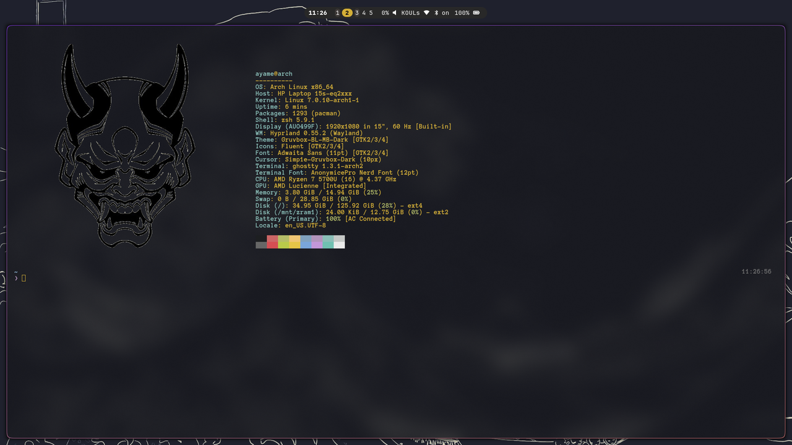
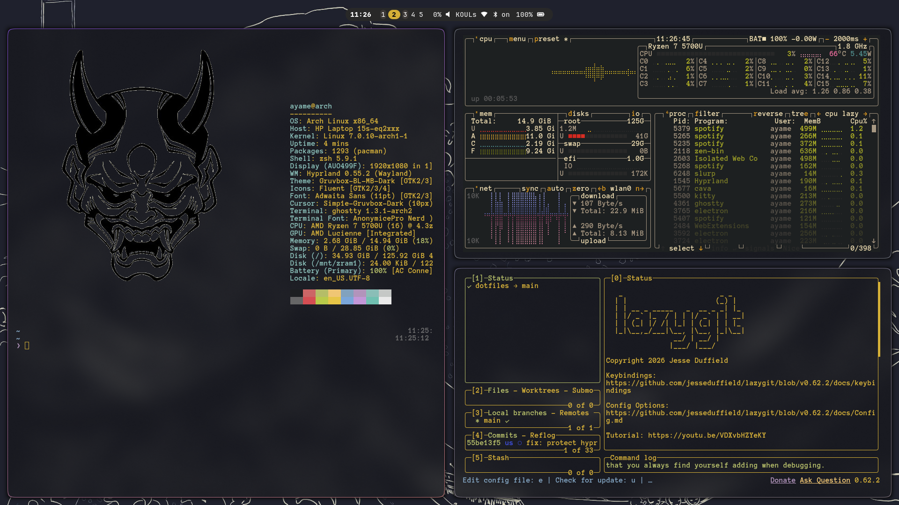

# dotfiles

Arch Linux + Hyprland workstation setup. One command installs packages, shell, and configs for a working desktop environment.
> > Arch + Hyprland reproducible setup

### Desktop


### Fastfetch


### Workflow


### Rofi

---

## Result

After running the installer on a fresh Arch user account:

- Hyprland compositor with keybinds, window rules, and autostart
- Waybar status bar with workspaces, clock, audio, and battery modules
- Zsh shell with Oh My Zsh, Powerlevel10k prompt, syntax highlighting, and autosuggestions
- Ghostty and Kitty terminals pre-configured
- Rofi app launcher, swaync notifications, hyprlock screen lock, wlogout power menu
- Gruvbox cursor and GTK theme applied system-wide
- Bluetooth enabled

---

## Prerequisites

- Arch Linux (this installer will not run on other distros)
- A working internet connection
- A non-root user account with `sudo` access
- Base packages: `git`, `curl`

---

## Install

```bash
git clone https://github.com/user-dsaw/dotfiles.git
cd dotfiles
chmod +x install.sh
./install.sh
```

The installer will:

1. Check for Arch Linux and non-root execution
2. Install `paru` (AUR helper) if not present
3. Install all packages via `paru`
4. Install Oh My Zsh and Powerlevel10k
5. Set Zsh as your default shell
6. Stow all configs to `$HOME` (backs up existing files, never deletes)
7. Enable bluetooth service

No hardcoded paths. Works regardless of where you clone the repo.

---

## What's included

| Package | Config location |
|---|---|
| `hypr` | `~/.config/hypr/` |
| `waybar` | `~/.config/waybar/` |
| `ghostty` | `~/.config/ghostty/` |
| `kitty` | `~/.config/kitty/` |
| `rofi` | `~/.config/rofi/` |
| `swaync` | `~/.config/swaync/` |
| `wlogout` | `~/.config/wlogout/` |
| `yazi` | `~/.config/yazi/` |
| `btop` | `~/.config/btop/` |
| `cava` | `~/.config/cava/` |
| `fastfetch` | `~/.config/fastfetch/` |
| `lazygit` | `~/.config/lazygit/` |
| `gtk` | `~/.config/gtk-3.0/` |
| `zsh` | `~/.zshrc`, `~/.p10k.zsh` |
| `themes` | `~/.icons/`, `~/.themes/` |

---

## What the installer does NOT do

- Modify GRUB or the bootloader
- Install or configure a display manager
- Touch any other user's environment
- Delete existing config files (conflicts are backed up as `filename.bak.<timestamp>`)

---

## Keybinds

| Keybind | Action |
|---|---|
| `SUPER + Return` | Terminal (ghostty) |
| `SUPER + D` | App launcher (rofi) |
| `SUPER + Q` | Close window |
| `SUPER + E` | File manager (yazi) |
| `SUPER + L` | Lock screen (hyprlock) |
| `SUPER + SHIFT + E` | Power menu (wlogout) |
| `SUPER + 1-5` | Switch workspace |
| `SUPER + SHIFT + 1-5` | Move window to workspace |
| `SUPER + H/J/K/L` | Move focus |

---

## License

MIT
